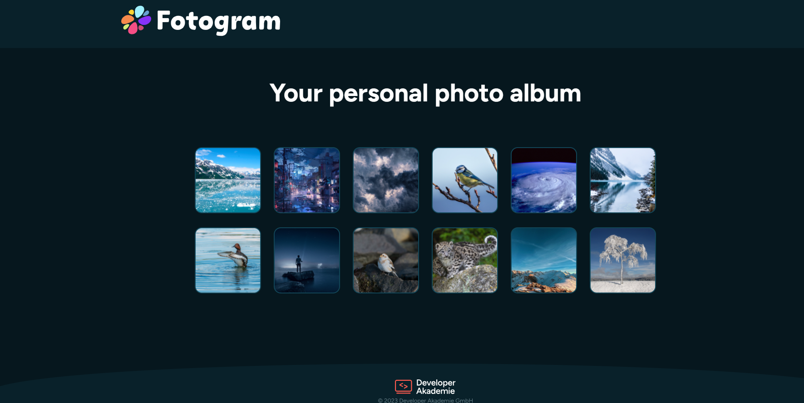

📸 Fotogram – Personal Photo Gallery

Eine responsive, barrierearme Foto-Galerie mit Dialog-Overlay, Keyboard-Navigation und Fokus-Management.

🚀 Live Demo

👉https://ismael993-create.github.io/Fotogramismael/

📷 Preview

🧩 Projektbeschreibung

Fotogram ist eine moderne Bildergalerie mit:

Thumbnail Grid Layout

Modal Dialog für Bildanzeige

Vor- und Zurück-Navigation

Tastatursteuerung

Fokus-Management

Responsive Design

Das Projekt legt besonderen Wert auf Accessibility (WCAG-orientiert) und saubere Strukturierung.

✨ Features

📷 Dynamische Bilderzeugung über JavaScript

🔍 Modal Dialog mit showModal()

⌨️ Vollständige Tastatursteuerung

🔁 Endlose Navigation (Loop-System)

🧠 Fokus-Rückgabe nach Dialog-Schließen

📱 Responsive Grid Layout

🎨 Modernes UI Design

♿ Accessibility (WCAG-orientiert)

Dieses Projekt wurde barrierearm umgesetzt:

✔️ Dialog mit aria-labelledby

✔️ Tastaturbedienung:

ArrowRight → nächstes Bild

ArrowLeft → vorheriges Bild

Escape → Dialog schließen

Tab → Fokus bleibt im Dialog (Focus Trap)

✔️ Fokus wird nach Schließen wieder auf das zuletzt aktive Thumbnail gesetzt

✔️ Buttons statt divs für interaktive Elemente

✔️ aria-labels für Screenreader

✔️ Strukturierte HTML-Semantik

⌨️ Steuerung
Taste	Funktion
Klick auf Thumbnail	Bild öffnen
Arrow Right	Nächstes Bild
Arrow Left	Vorheriges Bild
Escape	Dialog schließen
Tab	Fokus-Navigation im Dialog
🛠️ Verwendete Technologien

HTML5 (Semantisch strukturiert)

CSS3 (Grid, Flexbox, Media Queries)

Vanilla JavaScript (ES6)

Dialog API

Accessibility APIs

Google Fonts (Figtree)

📱 Responsive Verhalten

Desktop: 6 Spalten Grid

Tablet: 2 Spalten

Mobile: Optimiertes Dialog Layout

Flexible Dialog-Box mit Media Queries

🎯 Lernziele des Projekts

Arbeiten mit dem HTML <dialog> Element

Fokus-Management & Accessibility

Keyboard Event Handling

Dynamische DOM-Manipulation

Responsive Grid Layouts

Saubere UI-Struktur
